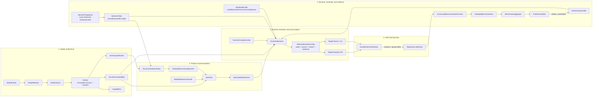

# Model management and performance decision SSOT

- **Status:** Accepted direction; incremental rollout
- **Date:** 2026-08-22
- **Architecture owner:** Atlas
- **Performance evidence owner:** Vector
- **Consumers:** Rapid Desktop, Rapid Server, CLI, benchmark tooling
- **Related evidence:**
  [long-context service prefill](../performance/2026-08-22-long-context-service-prefill.md),
  [Mac mini model matrix](../performance/2026-08-21-mac-mini-model-matrix.md)

## Context

Rapid-MLX already has useful per-model knowledge: stable aliases, model metadata,
compatibility gates, parser and sampling defaults, speculative-decoding tiers,
and benchmark-verified prefill recommendations. That knowledge currently lives
mostly in a sparse `ModelProfile` backed by `aliases.json`, with resolution spread
across several runtime entry points.

This has delivered real performance gains. For example, measured aliases can
select a smaller `prefill_step_size`, and an untouched Desktop launch benefits
because it starts the same CLI/server path. However, the current shape cannot yet
represent the complete decision we need:

> model artifact × quantization × machine class × workload × runtime version

It also does not carry enough provenance for the GUI to explain which values were
selected, why they are safe, or which benchmark evidence supports them. Community
benchmarks will make this riskier unless untrusted observations are separated from
production defaults by validation and promotion gates.

## Decision

Rapid-MLX will evolve toward one model-management and runtime-decision SSOT with
five explicit stages:

1. Immutable model and artifact identity records facts.
2. Validated performance and quality evidence determines eligibility.
3. Product policy produces an ordered, explainable recommendation set.
4. A single runtime resolver produces one `EffectiveRuntimeConfig`.
5. Consented runtime telemetry re-enters the evidence pipeline; it never edits a
   production profile directly.

Selection chooses **which model variant** to run. It does not select a performance
profile. The runtime resolver chooses **how that variant runs** for the current
machine and workload. Explicit user runtime flags take precedence over profile
recommendations, subject to hard compatibility and safety constraints.

## Target relationship model

The Mermaid source below is the durable, GitHub-rendered version of
`ssot_diagram3`. It is intentionally a relationship view rather than a physical
database schema.

## Entity contracts

| Entity | Owns | Must not own |
| --- | --- | --- |
| `ModelVariant` / `Artifact` | Stable identity, quantization/modality/format, immutable artifact revision and manifest | Product ranking or mutable performance claims |
| `Capabilities` | What the artifact can do | Quality judgement or defaults |
| `RuntimeCompatibility` | Supported runtime ranges and hard feature/safety constraints | Product preference |
| `VariantQualification` | Versioned quality-gate result for an artifact revision and runtime/eval range | Performance tuning |
| `MachineFingerprint` | Exact benchmark/runtime observation: SoC, OS, physical and available RAM, thermal/power state | Reusable default identity |
| `MachineClass` | Normalized hardware target such as `m3-max-64` | Volatile available RAM or thermal state |
| `WorkloadProfile` | Structured applicability: modality, context bucket, concurrency, latency objective, cache state, resolution/token mix | Free-form benchmark descriptions |
| `PerformanceProfile` | Promoted runtime knobs for artifact/quantization, machine class, workload, and runtime range | Model selection or unvalidated observations |
| `RankedRecommendationSet` | Ordered model candidates with role, reasons, tradeoffs, limitations, policy version | Runtime knob resolution |
| `EffectiveRuntimeConfig` | Final values plus field-level source, source ID, reason, override and fallback trace | New policy decisions in GUI or Server |

Physical RAM is used for model-fit classification. Available RAM is a runtime
safety input and may force a fallback; it must not change the machine's stable
class.

## Current implementation status

Legend:

- ✅ **Implemented:** usable production behavior exists and is covered by tests.
- 🟡 **Partial:** some semantics exist, but the target entity or provenance is
  incomplete.
- ⬜ **Planned:** target architecture only; no production implementation yet.

| Area | Status | Evidence in the repository | Missing before target state |
| --- | --- | --- | --- |
| Unified sparse per-model profile | ✅ | `vllm_mlx/model_profile.py`; `vllm_mlx/model_aliases.py`; `vllm_mlx/aliases.json` | Split stable identity, capabilities, qualification, and performance concerns without breaking consumers |
| Stable alias and HF-path lookup | ✅ | `resolve_profile()` and alias validation tests | Immutable artifact revision/manifest identity and first-class quantization identity |
| Parser, modality, sampling, optimization and safety metadata | ✅ | `ModelProfile` fields and per-feature tests | Explicit capability versus qualification boundaries |
| Bench-verified prefill defaults | ✅ | `recommended_prefill_step_size`; `_resolve_prefill_step_size()`; `tests/test_recurrent_prefill_auto_default.py` | Key recommendations by machine class, workload, runtime range, and evidence ID |
| User prefill override precedence | ✅ | `_resolve_prefill_step_size(... user_set_explicit=True)` tests | Generalize precedence to a typed runtime override layer |
| Separate language prefill and vision admission budgets | ✅ | `_resolve_vision_prefill_token_budget()` and MLLM regression tests | Represent both in one effective-config/provenance response |
| Desktop receives no-flag profile performance gains | 🟡 | Desktop launches the CLI/server without a default prefill override; see linked prefill audit | GUI cannot explain resolved value, source, tradeoff, or evidence |
| Central runtime resolution | 🟡 | Resolver helpers and `ModelProfile` consumers exist | One resolver API and one immutable `EffectiveRuntimeConfig` for every entry point |
| Machine fingerprint/class | ⬜ | Benchmark reports record hardware manually | Typed normalization, fit/safety split, schema and tests |
| Structured workload profile | ⬜ | Performance reports describe workload manually | Stable buckets and applicability matching |
| Performance candidate/promotion lifecycle | ⬜ | Evidence is reviewed manually before editing aliases | Candidate status, confidence rule, approval, audit, rollback and expiry |
| Versioned variant quality qualification | ⬜ | Individual safety/feature tiers exist in `ModelProfile` | Artifact/runtime/eval-bound qualification record and expiry |
| Recommendation policy and ranked set | 🟡 | Shared RAM-tier catalog and profile gates provide pieces | Ordered candidate contract, reason codes, policy version and explicit quality gate |
| Effective runtime config provenance | ⬜ | Startup logs expose some decisions | Field-level `value/source/source_id/reason_code/overrode`, fallback trace and API |
| Community benchmark ingestion | ⬜ | Reproducible internal benchmark documents exist | Submission protocol, trust, validation, dedup, aggregation, privacy and promotion |
| Actual-runtime learning loop | ⬜ | Runtime metrics exist independently | Consent, minimized schema, effective-config linkage and regression pipeline |

The table is normative project status. A component moves to ✅ only when its
contract, production path, proportional tests, and operational ownership exist.
Documentation or a schema alone does not count as implementation.

## Incremental delivery plan

### Phase 0 — preserve and document the working baseline (current)

- Keep explicit `ModelProfile` recommendations conservative and evidence-backed.
- Preserve the precedence rule: explicit user flag > verified profile > global
  default.
- Record benchmark environment, commands, runtime versions, variance and
  correctness in `docs/engineering/performance/`.

**Exit condition:** current defaults and GUI no-flag behavior remain covered by
regression tests. This phase is complete for prefill, but not for every profile
field.

### Phase 1 — make runtime decisions observable

- Introduce an internal `EffectiveRuntimeConfig` with field-level provenance.
- Route CLI and Server through the same resolver without changing defaults.
- Expose a read-only resolved-config endpoint/DTO for Desktop.
- Make Desktop show active optimizations, reasons, limitations, and user
  overrides without duplicating policy in Swift.

**Exit condition:** the same model launch yields the same resolved config through
CLI, Server and Desktop, and each non-global value identifies its source.

### Phase 2 — separate performance profiles from model facts

- Add `MachineFingerprint`, normalized `MachineClass`, and `WorkloadProfile`.
- Extract performance-only fields from the general profile behind a compatible
  adapter.
- Key `PerformanceProfile` by artifact/quantization, machine class, workload and
  supported runtime range.
- Migrate one narrow vertical slice first: prefill chunk and vision budget.

**Exit condition:** existing aliases produce byte-for-byte equivalent effective
values, while at least one profile varies safely by machine/workload.

### Phase 3 — evidence promotion and quality qualification

- Create `ProfileCandidate`, validation, confidence, promotion, rollback and
  expiry contracts.
- Create artifact- and runtime-bound `VariantQualification` records.
- Require a promoted evidence ID for every new automatic performance default.

**Exit condition:** changing a production default is an auditable promotion, not
an unstructured edit to `aliases.json`.

### Phase 4 — recommendations and community evidence

- Produce an ordered `RankedRecommendationSet` with reason codes and tradeoffs.
- Add consented benchmark submissions, protocol versions, contributor trust,
  deduplication and anomaly detection.
- Feed actual runtime regressions back as candidates/alerts only; never mutate a
  profile directly.

**Exit condition:** community evidence can improve recommendations while a bad or
malicious submission cannot bypass validation, qualification, or promotion.

## Invariants

1. User model-selection overrides and runtime-config overrides are separate.
2. Explicit runtime flags win unless they violate a hard safety or compatibility
   constraint; the resulting adjustment is visible in provenance.
3. Selection returns a `SelectedModelVariant`, not a profile candidate.
4. GUI, Server and CLI consume the same effective config and do not reimplement
   recommendation policy.
5. A benchmark claim is scoped to artifact revision, quantization, machine,
   workload, runtime stack and protocol version.
6. Community submissions and runtime telemetry cannot directly write a production
   performance profile.
7. Fallbacks remain qualified recommendations and preserve the user's intent as
   far as safety permits.
8. Every automatic default has a rollback path.

## Alternatives considered

### Keep adding fields to `aliases.json`

This is cheap and remains suitable during Phase 0, but it mixes facts, quality,
policy and performance evidence. It cannot safely express machine/workload scope
or evidence promotion, so it is a migration source rather than the final schema.

### Let Desktop own model recommendations and tuning

Rejected. Server and CLI would drift, non-technical users would see inconsistent
behavior, and every backend optimization would require a second implementation.
Desktop should render decisions and submit overrides, not make policy.

### Apply community benchmark winners directly

Rejected. Hardware state, thermal throttling, runtime revisions, correctness
failures, duplicated samples and malicious submissions all make an unvalidated
winner unsafe as a product default.

### Build the complete schema in one migration

Rejected. The existing sparse profile is production-critical and broad. The
phased approach gives each extracted entity an equivalence test and rollback path.

## Consequences

- The immediate cost is additional schema/versioning and a migration adapter.
- Runtime behavior becomes explainable and reproducible across GUI, Server and
  CLI.
- Performance defaults can become machine- and workload-specific without turning
  the GUI into a tuning panel.
- Product quality and runtime compatibility can block unsafe recommendations
  independently of raw speed.
- Community benchmarks become useful evidence rather than an unaudited source of
  truth.

## Updating this ADR

Each implementation PR that advances this design must:

1. update the status table row and phase exit condition it affects;
2. link the code/tests or performance evidence;
3. state whether the change preserves existing resolver precedence;
4. add a new ADR only if it changes an invariant or reverses this decision.

Do not mark the entire ADR complete. Progress is tracked per row and per phase so
the architecture can land safely over multiple releases.
